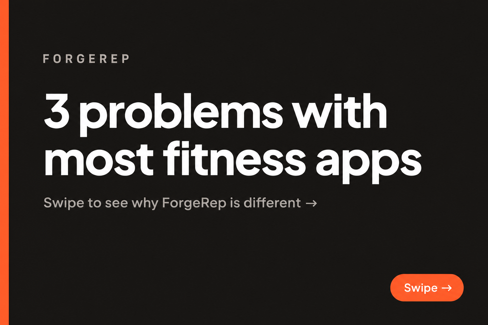
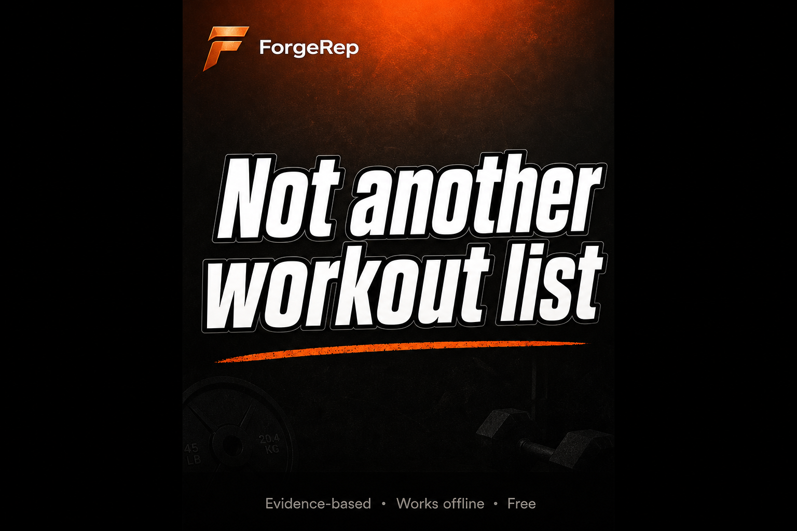
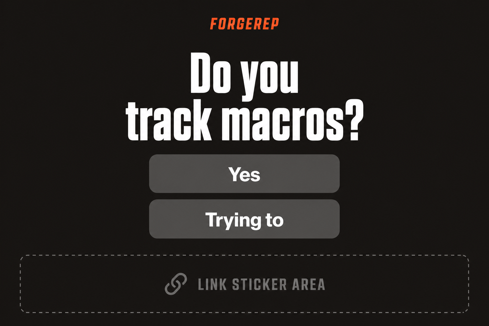
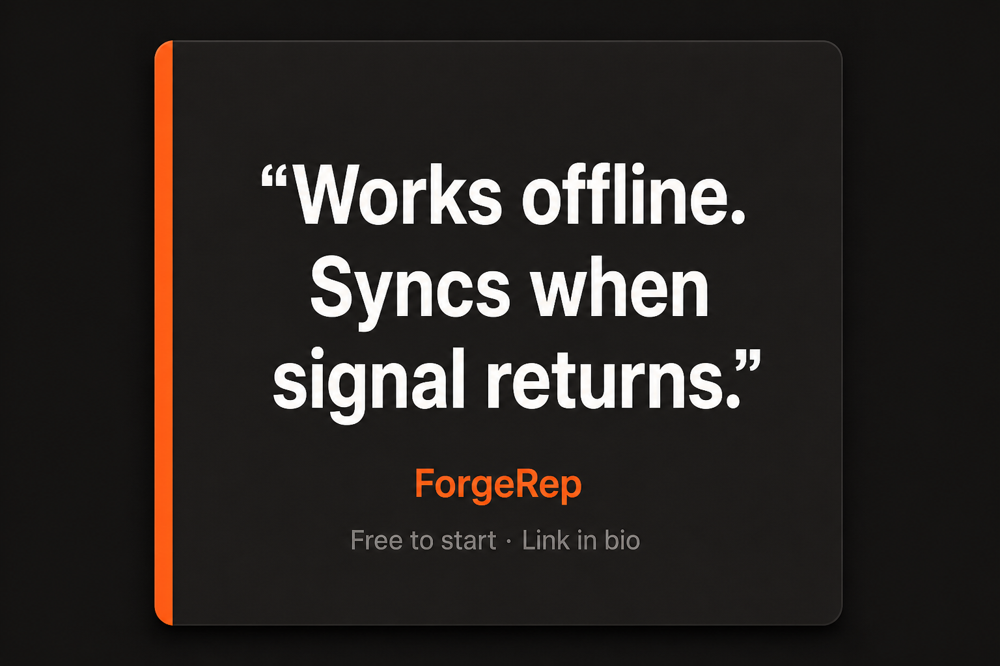
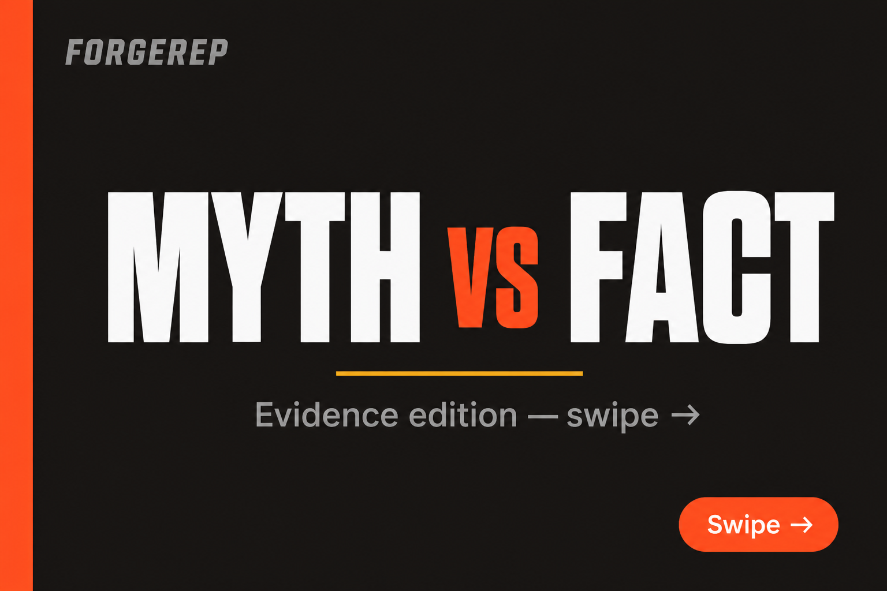
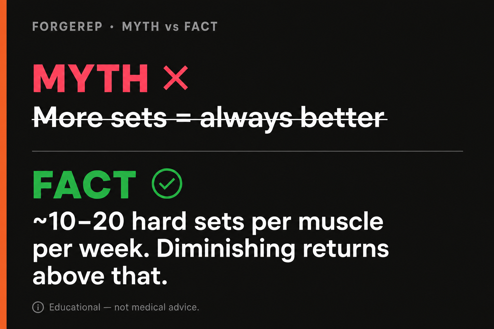

# ForgeRep Instagram — Canva Master Templates

> Visual references and step-by-step instructions for building the five reusable templates in Canva.  
> Pair with [instagram-31-day-calendar.md](./instagram-31-day-calendar.md).

**Last updated:** 2026-06-23

---

## Typography in Canva

Plus Jakarta Sans and Inter are **not** in Canva’s default library. Use one of the options below — pick one path and stick with it across all templates.

### Option A — Canva built-in (recommended, no setup)

| Role | Canva font | Weight | Notes |
|------|------------|--------|-------|
| Headlines | **Montserrat** | Bold or ExtraBold | Closest match to Plus Jakarta Sans — geometric, modern |
| Body / subtext | **Open Sans** | Regular or Medium | Clean, readable at small sizes |
| Eyebrows / labels | **Montserrat** | SemiBold, ALL CAPS | Same family as headlines |

**Alternative headlines if Montserrat feels too heavy:** **Poppins** Bold (slightly rounder, still on-brand)

### Option B — Upload custom fonts (Canva Pro)

Plus Jakarta Sans and Inter are free on [Google Fonts](https://fonts.google.com):

1. Download `.ttf` files for **Plus Jakarta Sans** (400, 600, 700, 800) and **Inter** (400, 500)
2. Canva → **Brand Kit** → **Brand fonts** → **Upload a font**
3. Use Plus Jakarta Sans for headlines, Inter for body — matches the app exactly

### Option C — Minimum effort

Use **Canva Sans** for everything. Less on-brand, but fine for getting Week 1 posted — swap to Montserrat later.

**Do not use:** script fonts, serif headlines, or Canva’s default “Instagram aesthetic” template fonts — they clash with Forge Ember’s dark gym look.

---

## Before you start

### Canva document sizes

| Template | Canva preset | Custom size |
|----------|--------------|-------------|
| Carousel slide | **Instagram Post** (portrait) | 1080 × 1350 px |
| Reel cover | **Instagram Story** | 1080 × 1920 px |
| Story | **Instagram Story** | 1080 × 1920 px |
| Quote card | **Instagram Post** (square) | 1080 × 1080 px |

### Brand kit (add once in Canva → Brand)

| Name | Hex | Use |
|------|-----|-----|
| Ember | `#FF6B35` | Accent bar, labels, CTAs |
| Surface | `#1C1917` | Main background |
| Surface Raised | `#292524` | Quote card inner panel |
| Text | `#FAFAF9` | Headlines, quotes |
| Muted | `#A8A29E` | Eyebrows, subtext |
| Gold | `#FBBF24` | MYTH vs FACT cover accent |
| Coral | `#FF4D6D` | MYTH labels (Forge Ember celebration — not error red) |
| Success | `#22C55E` | FACT labels, checkmarks |

**Fonts (Canva):** Montserrat (headlines) · Open Sans (body) — see [Typography in Canva](#typography-in-canva). App uses Plus Jakarta Sans + Inter; upload via Canva Pro if you want an exact match.

**Logo:** Upload PNG export from `apps/web/public/logo.svg` and `logo-icon.svg`

---

## Template 1 — Carousel slide



**Use for:** Myth vs fact, how-it-works steps, feature lists, FAQ slides

### Layout (top → bottom)

```
┌─────────────────────────────────────┐
│█│ FORGEREP              [optional]  │  ← orange bar 12px wide, full height
│█│                                   │
│█│  Headline (32–40pt, bold, white)  │
│█│                                   │
│█│  Body text (18–22pt, muted gray)  │
│█│                                   │
│█│                    [Swipe → pill] │
└─────────────────────────────────────┘
```

### Canva steps

1. **Create design** → Instagram Post (1080 × 1350)
2. **Background:** rectangle full bleed, color `#1C1917`
3. **Accent bar:** rectangle 12 × 1350 px, color `#FF6B35`, align left edge
4. **Eyebrow:** text `FORGEREP` — **Montserrat** SemiBold, 14pt, `#A8A29E`, ALL CAPS, letter spacing +200, position top-left with 48px padding from bar
5. **Headline:** **Montserrat** Bold, 36–44pt, `#FAFAF9`, max width ~900px, left-aligned, 48px from left (after bar)
6. **Body:** **Open Sans** Regular, 20pt, `#A8A29E`, same left margin, 24px below headline
7. **Swipe pill (slide 1 only):** rounded rectangle, `#FF6B35` at 20% opacity, border `#FF6B35`, text “Swipe →” in `#FF6B35`, bottom-right
8. **Save as template:** Canva → File → Save as brand template → name `ForgeRep Carousel`

### Slide variants to duplicate

| Variant | Headline area | Extra elements |
|---------|---------------|----------------|
| **Cover** | Big title + “Swipe →” | Orange pill bottom-right |
| **Content** | Title + 2–4 lines body | Optional bullet dots in `#FF6B35` |
| **Myth vs Fact** | See [Template 5](#template-5--myth-vs-fact-carousel) | Dedicated template — cover + content + CTA slides |
| **CTA (last slide)** | “Try it free” | Logo centered, URL below in `#FF6B35` |

---

## Template 2 — Reel cover



**Use for:** Thumbnail before someone taps your Reel — hook must read at small size

### Layout

```
┌─────────────────────────────────────┐
│ [icon] ForgeRep                     │  ← logo row, top 120px
│         (subtle orange glow top)    │
│                                     │
│                                     │
│     HOOK TEXT IN HUGE BOLD          │  ← center, 48–64pt
│     ─────────────                   │  ← orange underline optional
│                                     │
│                                     │
│ Evidence-based · Works offline    │  ← muted tagline, bottom
└─────────────────────────────────────┘
```

### Canva steps

1. **Create design** → Instagram Story (1080 × 1920) — Reels use same aspect ratio for covers
2. **Background:** `#1C1917`
3. **Top glow (optional):** circle gradient `#FF6B35` → transparent, blur 80, top center, 30% opacity
4. **Logo row:** `logo-icon.svg` ~48px height + “ForgeRep” wordmark or full logo, 48px from top-left
5. **Hook text:** **Montserrat** ExtraBold, **52–72pt**, `#FAFAF9`
   - Add **Effects → Stroke** (black, 4px) so text reads on any frame behind it when you swap covers in CapCut
   - Keep to **5–8 words max**
6. **Accent line:** 120 × 4 px rectangle `#FF6B35` under hook
7. **Tagline:** **Open Sans** Medium, 16pt, `#A8A29E`, bottom center, 80px from bottom — e.g. `Evidence-based · Works offline · Free`
8. **Save as template:** `ForgeRep Reel Cover`

### Tips

- Test readability: zoom out to thumbnail size in Canva before saving
- Export PNG and set in CapCut → Cover → Add cover

---

## Template 3 — Story slide



**Use for:** Polls, questions, link reminders, BTS — posted to Stories (add stickers in Instagram, not Canva)

### Layout

```
┌─────────────────────────────────────┐
│ FORGEREP                            │  ← orange eyebrow
│                                     │
│                                     │
│     Main message or question        │  ← 40–56pt, centered
│                                     │
│     [ leave space for IG stickers ] │
│                                     │
│ ┌ - - - - - - - - - - - - - - - ┐  │
│ │     LINK STICKER ZONE          │  │  ← keep bottom 350px clear
│ └ - - - - - - - - - - - - - - - ┘  │
└─────────────────────────────────────┘
```

### Canva steps

1. **Create design** → Instagram Story (1080 × 1920)
2. **Background:** `#1C1917`
3. **Eyebrow:** `FORGEREP` — 16pt, `#FF6B35`, ALL CAPS, top center, 64px from top
4. **Main text:** **Montserrat** Bold, 44–56pt, `#FAFAF9`, center-aligned, vertical center (shift up ~80px to leave sticker room)
5. **Do NOT draw link buttons in Canva** — Instagram link stickers must be added when posting (Meta Business Suite or phone)
6. **Safe zone guide (optional):** dashed rectangle 1080 × 350 at bottom, `#A8A29E` at 30% — delete before export or hide layer
7. **Save as template:** `ForgeRep Story`

### Story variants

| Type | Main text example | Add in Instagram |
|------|-------------------|------------------|
| Poll | “Do you track macros?” | Poll sticker |
| Question | “What’s your #1 fitness goal?” | Question sticker |
| Link CTA | “Start free today” | Link sticker → signup URL |
| Reshare | “New post ↑” | Mention + link to feed post |

**Rule:** Keep bottom **350px** empty for stickers and swipe-up area.

---

## Template 4 — Quote card (static post)



**Use for:** Quick static posts, myth-bust one-liners, offline/value props — fastest format (~5 min)

### Layout

```
┌─────────────────────────────────────┐
│                                     │
│   ┌─────────────────────────────┐   │
│█│  │                             │   │  ← raised card #292524
│█│  │  "Works offline.            │   │
│█│  │   Syncs when signal          │   │
│█│  │   returns."                  │   │
│█│  │                             │   │
│█│  │  ForgeRep                    │   │  ← orange brand line
│█│  │  Free to start · Link in bio │   │
│   └─────────────────────────────┘   │
│                                     │
└─────────────────────────────────────┘
```

### Canva steps

1. **Create design** → Instagram Post square (1080 × 1080)
2. **Background:** `#1C1917`
3. **Card panel:** rounded rectangle 920 × 720, corner radius 24, `#292524`, centered
4. **Accent bar:** 12 × 720 px `#FF6B35`, aligned to left edge of card panel
5. **Quote:** **Montserrat** SemiBold, 32–40pt, `#FAFAF9`, centered in card, max 2–3 lines
6. **Brand line:** “ForgeRep” — 20pt, `#FF6B35`, below quote
7. **Subline:** “Free to start · Link in bio” — 14pt, `#A8A29E`
8. **Save as template:** `ForgeRep Quote Card`

### Quote card text examples (swap and post)

- “Works offline. Syncs when signal returns.”
- “Evidence-based > Instagram hype.”
- “Your program + macros + progress = one app.”
- “Free doesn’t mean a fake program.”
- “Accountability the second you open the app.”

---

## Template 5 — Myth vs Fact carousel

**Use for:** Day 3, Day 7, Day 14, Day 18, Day 21 posts — high-save educational content that reinforces ForgeRep’s evidence-based positioning.

**Full carousel = 6 slides:** 1 cover → 4 myth/fact pairs → 1 CTA (duplicate from Template 1 CTA variant)

### Slide A — Cover



```
┌─────────────────────────────────────┐
│█│ FORGEREP                          │
│█│                                   │
│█│         MYTH  vs  FACT            │  ← "vs" in #FF6B35
│█│      ─────────────                │  ← gold line #FBBF24
│█│   Evidence edition — swipe →     │
│█│                                   │
│█│                    [Swipe → pill] │
└─────────────────────────────────────┘
```

#### Canva steps (cover)

1. Duplicate **Template 1** carousel or start fresh at 1080 × 1350, bg `#1C1917`, orange left bar
2. **Eyebrow:** `FORGEREP` — Montserrat SemiBold, 14pt, `#A8A29E`, ALL CAPS
3. **Title:** `MYTH` + `vs` + `FACT` on one line — Montserrat ExtraBold, 48–56pt
   - `MYTH` and `FACT` in `#FAFAF9`
   - `vs` in `#FF6B35`
4. **Accent line:** 160 × 4 px rectangle `#FBBF24`, centered below title
5. **Subtitle:** “Evidence edition — swipe →” — Open Sans Regular, 20pt, `#A8A29E`, centered
6. **Swipe pill:** same as Template 1 cover
7. **Save as:** `ForgeRep Myth vs Fact — Cover`

---

### Slide B — Myth / Fact content (duplicate for each pair)



```
┌─────────────────────────────────────┐
│█│ FORGEREP · MYTH vs FACT           │
│█│                                   │
│█│  ✕ MYTH                           │  ← #FF4D6D
│█│  More sets = always better        │  ← white, optional strikethrough
│█│  ─────────────────────────        │  ← divider #292524 or muted line
│█│  ✓ FACT                           │  ← #22C55E
│█│  ~10–20 hard sets/muscle/week.    │
│█│  Diminishing returns above that.  │
│█│                                   │
│█│  Educational — not medical advice │  ← 12pt muted, bottom
└─────────────────────────────────────┘
```

#### Canva steps (content slide)

1. **Create design** → Instagram Post (1080 × 1350), bg `#1C1917`, orange left bar 12px
2. **Eyebrow:** `FORGEREP · MYTH vs FACT` — Montserrat SemiBold, 13pt, `#A8A29E`, ALL CAPS, top-left (48px padding from bar)
3. **MYTH block** (top half, ~y: 180–520):
   - Label row: `✕` icon (or Canva element “X circle”) + text `MYTH` — Montserrat Bold, 18pt, `#FF4D6D`
   - Myth text — Montserrat SemiBold, 28–32pt, `#FAFAF9`, 1–2 lines max
   - Optional: **Effects → Strikethrough** on myth text at 40% opacity (subtle, not aggressive)
4. **Divider:** line or 920 × 1 px rectangle `#292524`, full width minus margins, between blocks
5. **FACT block** (bottom half, ~y: 560–900):
   - Label row: `✓` checkmark + text `FACT` — Montserrat Bold, 18pt, `#22C55E`
   - Fact text — Open Sans Regular, 22–26pt, `#FAFAF9`, 2–3 lines max — keep scannable
6. **Disclaimer:** “Educational — not medical advice” — Open Sans Regular, 12pt, `#A8A29E`, bottom-left, 48px from bottom
7. **Save as:** `ForgeRep Myth vs Fact — Content`

#### Tips

- **One myth per slide** — don’t cram two pairs on one slide
- Keep myth text **short and punchy** (what people actually believe)
- Keep fact text **specific** (numbers from evidence-kb when possible)
- Duplicate the content slide 4× and only change the text

---

### Slide C — CTA (last slide)

Reuse **Template 1 CTA variant:**

| Element | Content |
|---------|---------|
| Headline | Get a plan built on evidence |
| Subtext | forge-rep.com/signup |
| Logo | Centered, ~120px wide |
| Button text | Try it free — link in bio |

---

### Ready-to-use copy (from calendar + evidence-kb)

Duplicate the content slide and paste these pairs:

| # | MYTH | FACT |
|---|------|------|
| 1 | More sets = always better | ~10–20 hard sets per muscle per week. Diminishing returns above that. |
| 2 | Cut protein when dieting | 1.6–2.4 g/kg/day during a deficit. Higher when cutting aggressively. |
| 3 | Deload weeks are lazy weeks | Planned every ~6 training weeks. Recovery is part of the program. |
| 4 | Any workout app is the same | ForgeRep uses citable sports-science rules — not random templates or AI guesswork. |

**Day 3 carousel order:** Cover → rows 1–4 → CTA

---

### Export

1. In Canva, select all 6 pages
2. **Share → Download → PDF Standard** (best for Instagram carousel upload)
3. Or export each slide as PNG and upload as multi-image post
4. **Alt text:** “ForgeRep myth vs fact evidence-based fitness [topic]”

---

## Quick export checklist

Before posting from Canva:

- [ ] Colors match brand hex (no Canva default orange)
- [ ] Logo is sharp (SVG → PNG at 2× if needed)
- [ ] Carousel slide 1 has “Swipe →” cue
- [ ] Reel cover readable at phone thumbnail size
- [ ] Story bottom 350px is clear for stickers
- [ ] Myth vs Fact: MYTH in `#FF4D6D`, FACT in `#22C55E`, disclaimer on every content slide
- [ ] Export: **PNG** for static; **PDF Standard** for carousel multi-page upload

---

## File reference

| Mockup | Path |
|--------|------|
| Carousel | `docs/marketing/assets/template-carousel-slide.png` |
| Reel cover | `docs/marketing/assets/template-reel-cover.png` |
| Story | `docs/marketing/assets/template-story-slide.png` |
| Quote card | `docs/marketing/assets/template-quote-card.png` |
| Myth vs Fact cover | `docs/marketing/assets/template-myth-vs-fact-cover.png` |
| Myth vs Fact content | `docs/marketing/assets/template-myth-vs-fact-slide.png` |
