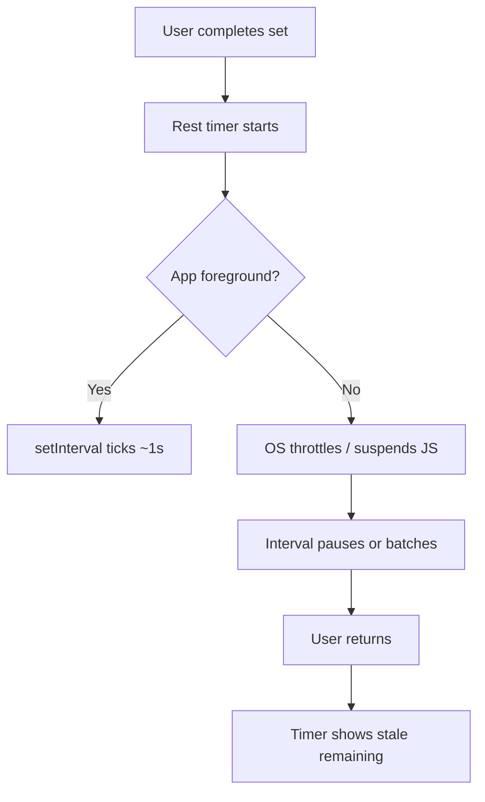

# Phase 12 — PWA Timer Accuracy (Background / Minimized)

**Status:** 12A + 12B code complete — device QA remaining; 12C deferred  
**Depends on:** Phase 3 (workout timers)  
**Branch:** `cursor/pwa-timer-background-8ab8`

## Problem

Workout timers (rest, timed sets, warmup, recovery) **stop or drift** when the PWA is minimized, the screen locks, or the user switches apps. Users return to find the timer frozen or far behind wall-clock time.

### Root cause (fixed in 12A)

Timers previously decremented via `setInterval` in `use-countdown.ts`. **Now** they use wall-clock `endsAtMs` deadlines reconciled on `visibilitychange`, `focus`, and `pageshow`.

### Affected surfaces

| Timer | Component | Trigger |
|-------|-----------|---------|
| Rest between sets | `RestTimer` → `useCountdown` | Auto after set complete |
| Timed holds / cardio | `HoldTimer` → `useCountdown` | User starts timer on set row |
| Warmup block | `HoldTimer` | Warmup card |
| Recovery block | `HoldTimer` | Recovery card |

`active-workout.tsx` orchestrates which timer is visible; fixing the hook fixes all four.

---

## Platform behavior (why this happens)



| Platform | Background JS timers | Audio on complete | Notes |
|----------|---------------------|-------------------|-------|
| **iOS Safari / installed PWA** | Heavily throttled; often **frozen** after a few seconds | Blocked until foreground | No reliable background `setInterval` |
| **Android Chrome PWA** | Throttled (minimum 1s+ drift, often paused) | Blocked until foreground | Slightly better with Wake Lock |
| **Desktop Chrome** | Throttled in background tabs | Works if tab audible | DevTools can simulate |

**Implication:** We cannot depend on interval ticks for timekeeping. We must use **wall-clock deadlines** and **reconcile on resume**.

---

## Strategy — defense in depth

### Layer 1 — Deadline-based timer (required, fixes ~90%)

Replace tick-counting with absolute end time.

**Model:**

```ts
interface DeadlineTimerState {
  endsAtMs: number;        // Date.now() + remaining when started/resumed
  totalSeconds: number;      // original duration (for progress bar)
  paused: boolean;
  pausedRemainingMs?: number; // frozen remaining while paused
}
```

**Remaining calculation:**

```ts
function remainingSeconds(state: DeadlineTimerState, now = Date.now()): number {
  if (state.paused && state.pausedRemainingMs != null) {
    return Math.ceil(state.pausedRemainingMs / 1000);
  }
  return Math.max(0, Math.ceil((state.endsAtMs - now) / 1000));
}
```

**UI updates:**

- While **visible**: `requestAnimationFrame` or `setInterval(250)` only to refresh display (not to measure time).
- On **`visibilitychange` → visible**, `focus`, `pageshow`: recompute remaining immediately; if `now >= endsAtMs`, fire `onComplete` synchronously.

**Files:**

- Rewrite `apps/web/src/components/workout/use-countdown.ts` (or add `use-deadline-countdown.ts` and migrate callers).
- Unit tests: pause/resume, background gap simulation (`now` mocked), complete-while-hidden.

---

### Layer 2 — Foreground catch-up + user feedback (required)

When the user returns after the deadline passed:

1. Fire `onComplete` immediately (rest clears, hold logs elapsed, etc.).
2. Play completion sound + short vibration (`navigator.vibrate`) if allowed.
3. Show a subtle in-app banner: *"Rest finished while you were away"* (rest only).

This matches user expectation: **wall-clock rest was honored** even if the UI froze.

---

### Layer 3 — Screen Wake Lock (recommended)

[`navigator.wakeLock`](https://developer.mozilla.org/en-US/docs/Web/API/Screen_Wake_Lock_API) keeps the screen on during an active timer (gym UX) and reduces throttling on some Android builds.

**Rules:**

- Request `'screen'` wake lock when any workout timer starts (not paused).
- Release on: timer complete, skip/stop, pause, component unmount, `visibilitychange` hidden (lock is auto-released — re-request on visible if timer still running).
- Feature-detect; no-op on unsupported browsers (iOS < 16.4, older Android).

**Files:**

- New `apps/web/src/hooks/use-screen-wake-lock.ts`
- Wire from `active-workout.tsx` when `restSeconds | timedTimer | warmupTimer | recoveryTimer` active.

---

### Layer 4 — Persist active timer across reload (recommended for PWA)

If the OS evicts the PWA process, in-memory React state is lost.

**Persist to `sessionStorage`** (per active workout tab):

```ts
interface PersistedActiveTimer {
  sessionClientId: string;
  kind: "rest" | "hold" | "warmup" | "recovery";
  endsAtMs: number;
  paused: boolean;
  pausedRemainingMs?: number;
  label?: string;
  // hold-specific: setClientId, exerciseId
}
```

On `active-workout` mount: if persisted timer matches `clientId` and `endsAtMs > now` (or expired → catch-up), restore timer state.

Clear persistence on complete / skip / discard workout.

---

### Layer 5 — Background notification at rest end (optional, Phase 12C)

Exact-second alerts while the app is **fully backgrounded** are **not reliably possible on iOS PWA** without push infrastructure. Scope accordingly:

| Approach | iOS PWA | Android PWA | Effort |
|----------|---------|-------------|--------|
| Catch-up on resume (Layer 2) | ✅ | ✅ | Low |
| `showTrigger` / scheduled local notification | ❌ / limited | Partial | Medium |
| Service Worker `setTimeout` | ❌ throttled | Unreliable | Low value |
| Web Push via backend | ✅ (iOS 16.4+ installed) | ✅ | High |

**Pragmatic Phase 12C (Pro+ or all tiers TBD):**

- Prompt once: *"Notify me when rest ends"* → `Notification.requestPermission()`.
- On timer start, if permission `granted` and `ServiceWorkerRegistration.showNotification` available:
  - **Android:** experiment with `showTrigger` timestamp (where supported).
  - **All platforms fallback:** notification fired on **resume catch-up** if deadline passed (user still gets alerted when they open the app).

Do **not** block Layer 1–2 on push. Document iOS limitation in UI copy.

Service worker already handles `push` + `notificationclick` in `apps/web/src/app/sw.ts` — reuse for future push, not for local rest timer in 12A.

---

## Implementation phases

### 12A — Deadline timer + visibility reconcile (ship first)

| Task | Detail |
|------|--------|
| Rewrite countdown hook | Deadline-based remaining; pause freezes `pausedRemainingMs` |
| Visibility listeners | `visibilitychange`, `pageshow`, `focus` → reconcile |
| Expired-while-hidden | Immediate `onComplete` + sound |
| Tests | Mock `Date.now`, simulate 90s background gap |
| QA | iOS installed PWA + Android installed PWA |

**Done when:** 90s rest with app minimized 60s shows ≤2s drift on return and auto-completes if time elapsed.

### 12B — Wake Lock + sessionStorage persistence

| Task | Detail |
|------|--------|
| `use-screen-wake-lock` | Acquire/release lifecycle |
| `active-timer-persistence.ts` | Save/restore/clear |
| `active-workout.tsx` | Restore on mount after kill |

**Done when:** Kill app mid-rest → reopen workout → timer resumes or completes correctly.

### 12C — Notifications (optional)

| Task | Detail |
|------|--------|
| Permission UX | One-time prompt in rest timer footer |
| Resume notification | If deadline passed and permission granted |
| Android `showTrigger` spike | Feature-detect; ship only if stable |

**Deferred** until after installed-PWA QA for 12A/12B. Not required to mark Phase 12 core complete.

---

## File plan

| File | Change |
|------|--------|
| `apps/web/src/components/workout/use-countdown.ts` | Deadline rewrite |
| `apps/web/src/components/workout/use-countdown.test.ts` | New tests |
| `apps/web/src/hooks/use-screen-wake-lock.ts` | Wake Lock wrapper |
| `apps/web/src/lib/workouts/active-timer-persistence.ts` | sessionStorage CRUD |
| `apps/web/src/components/workout/active-workout.tsx` | Persistence + wake lock + catch-up banner |
| `apps/web/src/components/workout/rest-timer.tsx` | Optional "away" message prop |
| `docs/ARCHITECTURE.md` | Timer section |
| `docs/BIBLE.md` | Phase 12 row |

**No service worker changes required for 12A/12B.**

---

## Testing matrix

| Scenario | Expected |
|----------|----------|
| Rest 90s, stay in app | Completes at ~90s ±1s |
| Rest 90s, lock screen 45s, unlock | Shows ~45s left |
| Rest 30s, switch apps 40s, return | Rest cleared; next set ready |
| Hold timer, minimize, return | Elapsed reflects wall clock |
| Pause mid-rest, background 60s, return | Still paused at same remaining |
| Reload PWA mid-rest (12B) | Timer restored from sessionStorage |
| Airplane mode + offline workout | Timers unaffected (local only) |

### DevTools simulation

Chrome → Performance → CPU throttling + **Rendering → Emulate inactive tab** to verify reconcile logic before device QA.

---

## UX / copy notes

- Wake Lock: no permission dialog on modern browsers; optional tooltip *"Keeps screen awake during rest"*.
- iOS limitation (if user asks why no background alert): *"Rest time still counts down — you'll see the update when you return to ForgeRep."*
- Never shame color for missed timer; use `forge-success` on catch-up complete.

---

## Non-goals

- Sub-second precision for competitive timing
- Syncing timer with Spotify playback (see `docs/spotify-integration-plan.md`)
- Native iOS/Android app background modes
- Pushing rest timer state to Supabase (local-only)

---

## Risks

| Risk | Mitigation |
|------|------------|
| `onComplete` double-fire | Idempotent guard ref (already in hook) |
| Wake Lock denied | Graceful no-op |
| sessionStorage cleared by user | Treat as no persisted timer |
| Clock skew | Use `Date.now()` only (monotonic `performance.now()` for display deltas optional) |
