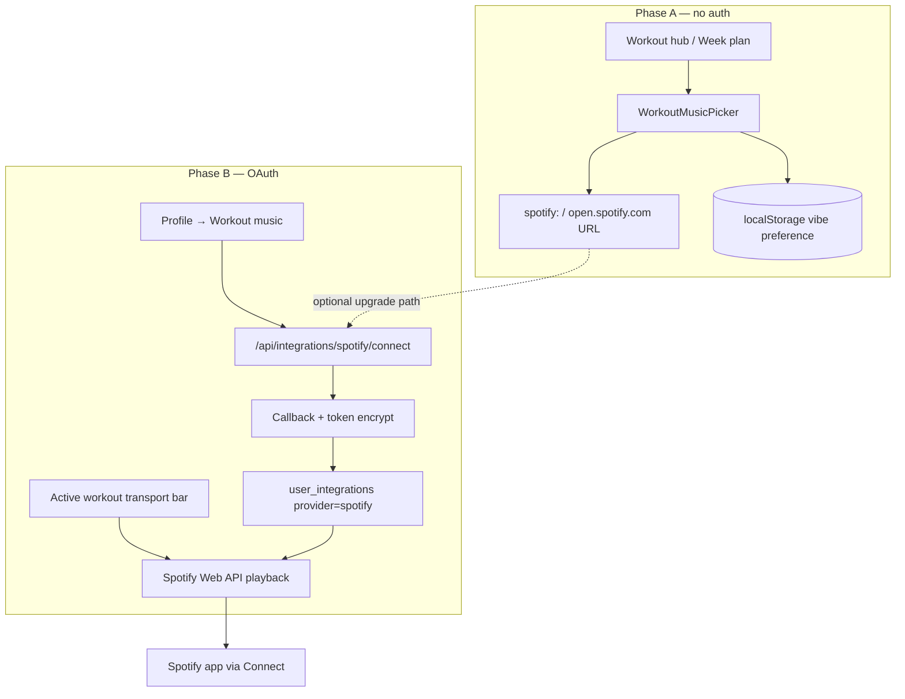

# Spotify Workout Music — Phase A & B Plan

> Roadmap for adding workout music to ForgeRep without blocking offline logging.  
> **Status:** Phase A shipped · Phase B planned

## Goals

1. Help users start workouts with energy — one tap to music, zero friction on first workout.
2. Keep workout logging **fully offline**; music is a companion experience in Spotify’s app.
3. Reuse existing OAuth/token patterns for Phase B without coupling music to Pro+ device sync.
4. **Do not** embed streaming in the PWA (Web Playback SDK) — poor iOS gym UX and commercial approval risk.

## Non-goals

- In-browser audio playback (Web Playback SDK)
- Apple Music / YouTube Music (future ADR if demand exists)
- Syncing rest timer with music pause/duck
- Offline Spotify inside ForgeRep (users rely on Spotify app offline mode)

---

## Tier placement

| Capability | Free | Pro | Pro+ | External requirement |
|------------|:----:|:---:|:----:|----------------------|
| Phase A — curated playlist deep links | ✓ | ✓ | ✓ | Spotify app or web (Free or Premium) |
| Phase B — connect Spotify + in-session controls | ✓ | ✓ | ✓ | **Spotify Premium** for playback API |
| Phase B — auto-start playlist on workout begin | ✓ | ✓ | ✓ | Premium + active Connect device |

**Rationale:** Music improves the core training loop for every tier. Spotify Premium is the paywall — not ForgeRep Pro+. Device integrations (`device_integrations` gate) stay separate in Profile → Integrations.

---

## Architecture overview



Phase A and B coexist: disconnected users keep deep links; connected Premium users get transport + optional auto-start.

---

## Phase A — Curated playlist deep links

**Effort:** ~1–2 days · **Backend:** none · **Migration:** none

### UX

1. **Workout hub** — above “Start workout” on today’s session (`WeekPlanCard` / day row):
   - Horizontal chip row: **Focus · Pump · Cardio · Cooldown** (4–6 vibes)
   - Subcopy: “Opens in Spotify”
   - Remember last-selected vibe in `localStorage`

2. **Active workout** — compact row under step header:
   - “Now playing vibe: Pump” → tap reopens same playlist in Spotify
   - Does not block logging if dismissed

3. **Optional:** same picker on pre-workout hype banner area in `active-workout.tsx` (first step only)

### Data

Static config in code (no DB):

```ts
// apps/web/src/lib/workout-music/catalog.ts
export type WorkoutMusicVibe = "focus" | "pump" | "cardio" | "cooldown";

export interface WorkoutMusicPlaylist {
  vibe: WorkoutMusicVibe;
  label: string;
  description: string;
  /** Spotify playlist ID — replace with ForgeRep-owned playlists before launch */
  spotifyPlaylistId: string;
}

export function spotifyPlaylistUrl(id: string): string {
  return `https://open.spotify.com/playlist/${id}`;
}
```

**Pre-launch task:** Create 4–6 public ForgeRep playlists on a brand Spotify account; swap placeholder IDs.

### Deep link behavior

Use a single `https://open.spotify.com/playlist/{id}` link from the user tap. On iOS and installed PWAs, do **not** use `target="_blank"` or `spotify:` custom schemes — both cause a blank in-app browser flash before Spotify opens. Universal https links hand off to the native app from the same browsing context.

```ts
function openSpotifyPlaylist(playlistId: string) {
  const link = document.createElement("a");
  link.href = spotifyPlaylistUrl(playlistId);
  if (!isIosOrStandalonePwa()) link.target = "_blank";
  link.click();
}
```

Playlist IDs must be **public user/community playlists** — Spotify editorial IDs (`37i9dQZF1…`) are often unavailable outside the Spotify app.

Use a single user gesture (button click) — required for iOS.

### Branding

- Follow [Spotify design guidelines](https://developer.spotify.com/documentation/design): green “Listen on Spotify” lockup or icon + attribution on the picker card.
- No Spotify logo in app icon or ForgeRep wordmark mashups.

### Files (Phase A)

| File | Purpose |
|------|---------|
| `apps/web/src/lib/workout-music/catalog.ts` | Vibe definitions + URL helpers |
| `apps/web/src/lib/workout-music/preferences.ts` | `localStorage` read/write for last vibe |
| `apps/web/src/components/workout/workout-music-picker.tsx` | Chip UI + open handler |
| `apps/web/src/components/workout/week-plan-card.tsx` | Mount picker above start CTA |
| `apps/web/src/components/workout/active-workout.tsx` | Compact “reopen music” strip |

### Acceptance criteria (Phase A)

- [x] User can pick a vibe and Spotify opens (app or browser) on iOS Safari PWA and Android Chrome
- [x] Last vibe persists across sessions on same device
- [x] Workout start, set logging, and offline sync unchanged when offline
- [x] Spotify attribution visible on picker
- [x] No new env vars or API routes

---

## Phase B — OAuth + playback control

**Effort:** ~4–6 days · **Depends on:** Phase A catalog (reuse playlist IDs)

### UX

1. **Profile → Workout music** (new section, **not** under Pro+ Integrations):
   - Connect / Disconnect Spotify
   - Default vibe or “My playlist” (optional: pick from user’s playlists via API)
   - Toggle: **Auto-start music when workout begins** (default off)
   - Disclosure: Premium required for in-app controls; Free Spotify users can still use Phase A links

2. **Active workout — transport bar** (when connected + Premium active device):
   - Track name + artist (truncated)
   - Previous · Play/Pause · Next
   - “Open in Spotify” fallback link
   - Hidden when API returns `NO_ACTIVE_DEVICE` or user is Free tier on Spotify

3. **Workout start hook** (`workout-hub.tsx` → after `startWorkoutSession`):
   - If auto-start enabled and Spotify connected → `PUT /me/player/play` with context URI from default vibe/playlist
   - Non-blocking: failure shows toast, never blocks session creation

### OAuth

- **Flow:** Authorization Code with **PKCE** (SPA-safe; matches Spotify current guidance)
- **Scopes:**
  - `user-read-playback-state`
  - `user-modify-playback-state`
  - `playlist-read-private` (only if “pick my playlist” is shipped; can defer)
- **Redirect:** `/api/integrations/spotify/callback`
- **Token storage:** Reuse `user_integrations` with new provider `spotify` (encrypted access + refresh tokens, same as Fitbit)
- **No sync cron** — Spotify is on-demand playback, not data import

### Database

Migration `20260610870000_spotify_integration.sql`:

```sql
alter type integration_provider add value if not exists 'spotify';

-- Optional user prefs (avoid overloading integrations row)
alter table profiles
  add column if not exists workout_music_auto_start boolean not null default false,
  add column if not exists workout_music_default_vibe text
    check (workout_music_default_vibe is null or workout_music_default_vibe in (
      'focus', 'pump', 'cardio', 'cooldown'
    ));
```

RLS: users update own `profiles` columns via existing profile update policy.

### Package layer

`packages/integrations/src/spotify.ts`:

| Export | Purpose |
|--------|---------|
| `SPOTIFY_OAUTH_*` | Authorize + token URLs |
| `buildSpotifyAuthorizeUrl({ clientId, redirectUri, state, codeChallenge, scopes })` | PKCE authorize |
| `exchangeSpotifyAuthorizationCode(...)` | Token exchange |
| `refreshSpotifyAccessToken(...)` | Refresh |
| `fetchSpotifyPlaybackState(token)` | Now playing |
| `startSpotifyPlayback(token, { contextUri \| uris })` | Start playlist |
| `transferSpotifyPlayback(token, deviceId?)` | Connect handoff if needed |
| `spotifyPlaybackControl(token, action)` | pause / next / previous |

Extend `IntegrationProvider`:

```ts
export type IntegrationProvider = "withings" | "fitbit" | "strava" | "spotify";
```

### App layer

| Path | Purpose |
|------|---------|
| `apps/web/src/lib/integrations/config.ts` | `SPOTIFY_CLIENT_ID`, `SPOTIFY_CLIENT_SECRET`, redirect URI |
| `apps/web/src/lib/integrations/spotify-service.ts` | Connect/disconnect, token refresh, playback wrappers |
| `apps/web/src/app/api/integrations/spotify/connect/route.ts` | PKCE + redirect |
| `apps/web/src/app/api/integrations/spotify/callback/route.ts` | Exchange + upsert row |
| `apps/web/src/app/api/integrations/spotify/disconnect/route.ts` | Revoke + delete row |
| `apps/web/src/app/api/integrations/spotify/playback/route.ts` | GET state · POST play/pause/skip (authenticated) |
| `apps/web/src/components/profile/workout-music-setting.tsx` | Profile UI |
| `apps/web/src/components/workout/workout-music-transport.tsx` | Active workout controls |

**Important:** Do **not** add Spotify to `INTEGRATION_AVAILABLE` / `integrations-setting.tsx` Pro+ list. Use dedicated `workout-music-setting.tsx` to avoid implying Pro+ is required.

### Env vars

```bash
# .env.example
# SPOTIFY_CLIENT_ID=
# SPOTIFY_CLIENT_SECRET=
# Optional: comma-separated redirect URIs registered in Spotify Dashboard
```

Register redirect URIs in [Spotify Developer Dashboard](https://developer.spotify.com/dashboard):

- `http://localhost:3000/api/integrations/spotify/callback`
- `https://<production-domain>/api/integrations/spotify/callback`

### Error handling

| API response | User-facing behavior |
|--------------|---------------------|
| 401 token expired | Silent refresh; reconnect if refresh fails |
| 403 Premium required | “In-app controls need Spotify Premium. You can still open playlists from the vibe picker.” |
| 404 NO_ACTIVE_DEVICE | “Open Spotify on this phone, then try again.” + deep link |
| Offline | Hide transport; Phase A links still work when back online |

### Privacy

Update `apps/web/src/app/(marketing)/privacy/page.tsx` § Integrations:

- Spotify: playback control and optional playlist metadata; no listening history stored in ForgeRep DB beyond last sync error on integration row.

### Acceptance criteria (Phase B)

- [ ] User connects Spotify from Profile without Pro+ subscription
- [ ] Disconnect removes tokens and hides transport
- [ ] Transport play/pause/skip works when Spotify app is active on same device (Premium)
- [ ] Auto-start optionally begins default vibe playlist on workout start (online only)
- [ ] Playback failures never block workout session creation
- [ ] `user_integrations.provider = 'spotify'` row with encrypted tokens; no playback history table
- [ ] `.env.example`, privacy page, and `docs/TIER-GATES.md` updated (music row under Core training)

---

## Implementation order

| Step | Phase | Task |
|------|-------|------|
| 1 | A | Create ForgeRep Spotify playlists; fill `catalog.ts` IDs |
| 2 | A | Build `WorkoutMusicPicker` + hub integration |
| 3 | A | Add compact strip to active workout |
| 4 | A | QA on iOS PWA + Android |
| 5 | B | Spotify Developer app + env vars |
| 6 | B | Migration + `packages/integrations/src/spotify.ts` |
| 7 | B | OAuth routes (PKCE cookies mirror Fitbit pattern) |
| 8 | B | Profile workout music section |
| 9 | B | Playback API route + transport component |
| 10 | B | Auto-start toggle + workout-hub hook |
| 11 | B | Docs + privacy + PROGRESS entry |

---

## Testing checklist

### Phase A

- [ ] Tap vibe → Spotify opens (installed app)
- [ ] Tap vibe → Spotify web player (no app installed)
- [ ] Start workout offline → logging works; music picker hidden or shows “needs network”
- [ ] Preference survives page reload

### Phase B

- [ ] Full OAuth connect / disconnect cycle
- [ ] Token refresh after 55+ minutes
- [ ] Play/pause/skip with Spotify in foreground
- [ ] Auto-start fires once per session start, not on resume
- [ ] Free Spotify account → graceful Premium message
- [ ] User with Connect on desktop only → NO_ACTIVE_DEVICE messaging

---

## Future (out of scope for A/B)

- **Phase C:** User picks any playlist from their library (`playlist-read-private`)
- **Phase D:** BPM-aware vibe suggestion for timed cardio blocks
- **Phase E:** Native app Spotify iOS/Android SDK (if ForgeRep ships native shells)
- **Apple Music:** MusicKit JS — separate ADR; only if user demand warrants

---

## Related code today

| Area | Path |
|------|------|
| OAuth pattern (reference) | `apps/web/src/app/api/integrations/fitbit/*` |
| Token encrypt/store | `apps/web/src/lib/integrations/service.ts` |
| Integration enum | `supabase/migrations/20260609700000_user_integrations.sql` |
| Workout start | `apps/web/src/components/workout/workout-hub.tsx` → `handleStart` |
| Active session UI | `apps/web/src/components/workout/active-workout.tsx` |
| Timer sounds (only audio today) | `apps/web/src/lib/audio/timer-sounds.ts` |
